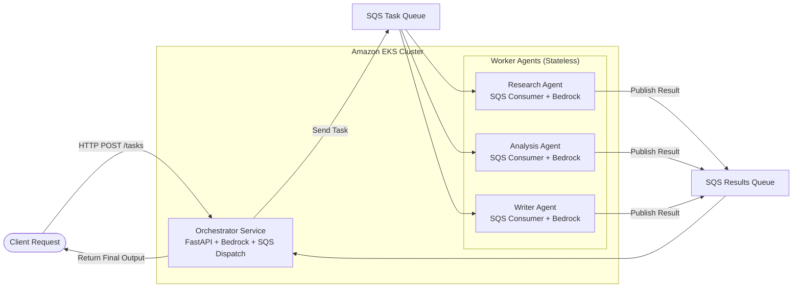
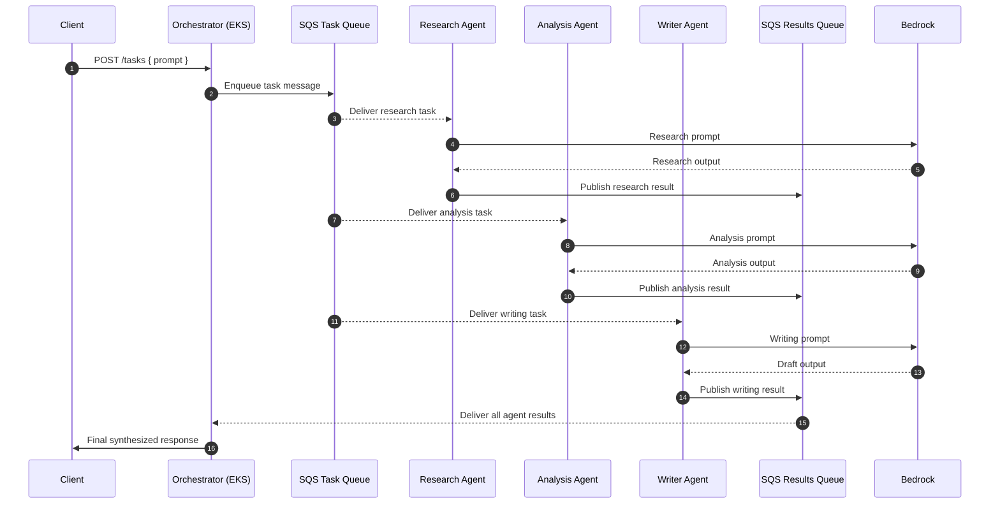

# AWS Bedrock EKS Agent Platform

A secure, event‑driven **multi‑agent AI platform** running on **Amazon EKS**, using:

- **Amazon Bedrock — `us.anthropic.claude-3-haiku-20240307-v1:0`** as the primary LLM  
- **OpenAI GPT‑4o** as a hot‑standby fallback  
- **Amazon SQS** for all inter‑agent communication  
- **Terraform** for infrastructure  
- **AWS CodeBuild** for CI/CD (no local Docker Desktop required)  

This platform is a full refactor of the  
➡️ **Azure OpenAI AKS Agent Platform**, rebuilt natively for AWS.

---

## **Architecture Overview**



See `docs/architecture.md` for:

- Component map  
- Request flow  
- IRSA identity model  
- Architecture Decision Records (ADRs)

---

## **Event‑Driven Workflow**



---

## **Prerequisites**

| Tool      | Version |
|-----------|---------|
| Terraform | ≥ 1.7   |
| AWS CLI   | ≥ 2.15  |
| kubectl   | ≥ 1.29  |
| kustomize | ≥ 5.0   |
| jq        | Optional |

**AWS Requirements**

- OIDC federation for GitHub Actions  
  - `role/github-actions-terraform`  
  - `role/github-actions-ecr`  
- OR a local IAM profile with `AdministratorAccess`  
- AWS CodeBuild projects for each agent + orchestrator  
- EKS cluster deployed in **us-east-1**

Bedrock models are auto‑enabled in most accounts.  
This platform uses:

```
us.anthropic.claude-3-haiku-20240307-v1:0
```

---

## **Getting Started (7 Steps)**

### **1. Bootstrap Terraform state backend**

```bash
aws s3 mb s3://tfstate-aiplatform-dev --region us-east-1

aws dynamodb create-table \
  --table-name tfstate-lock \
  --attribute-definitions AttributeName=LockID,AttributeType=S \
  --key-schema AttributeName=LockID,KeyType=HASH \
  --billing-mode PAY_PER_REQUEST \
  --region us-east-1
```

---

### **2. Verify Bedrock model availability**

Ensure the following model is available in `us-east-1`:

```
us.anthropic.claude-3-haiku-20240307-v1:0
```

If not visible, request access via AWS support.

---

### **3. Update tfvars**

Edit `infra/environments/dev/terraform.tfvars`:

```hcl
admin_principal_arn = "arn:aws:iam::<account-id>:user/your-iam-user"
alert_email         = "you@example.com"
```

---

### **4. Deploy infrastructure**

```bash
cd infra/environments/dev
terraform init
terraform apply
```

Record outputs:

- `agent_role_arns`  
- `ecr_repository_urls`  

---

### **5. Populate secrets**

```bash
aws secretsmanager put-secret-value \
  --secret-id aiplatform/dev/openai \
  --secret-string '{"api_key":"sk-..."}'
```

---

### **6. Install Secrets Store CSI Driver + AWS provider**

```bash
aws eks update-kubeconfig --name eks-aiplatform-dev --region us-east-1

# Install AWS provider installer (required)
kubectl apply -f https://raw.githubusercontent.com/aws/secrets-store-csi-driver-provider-aws/main/deployment/aws-provider-installer.yaml

# Install Secrets Store CSI Driver
helm repo add secrets-store-csi-driver \
  https://kubernetes-sigs.github.io/secrets-store-csi-driver/charts

helm install secrets-store-csi-driver \
  secrets-store-csi-driver/secrets-store-csi-driver \
  --namespace kube-system \
  --set syncSecret.enabled=true

# Install AWS provider for Secrets Store CSI Driver
helm repo add aws-secrets-manager \
  https://aws.github.io/secrets-store-csi-driver-provider-aws

helm install aws-secrets-provider \
  aws-secrets-manager/secrets-store-csi-driver-provider-aws \
  --namespace kube-system
```

No sed patching required — account IDs are already wired into manifests.

---

### **7. Deploy to Kubernetes**

```bash
# Apply K8s manifests
kubectl apply -k k8s/overlays/dev

# Trigger CodeBuild builds for all 4 agents
aws codebuild start-build --project-name aiplatform-orchestrator-dev --region us-east-1
aws codebuild start-build --project-name aiplatform-research-agent-dev --region us-east-1
aws codebuild start-build --project-name aiplatform-analysis-agent-dev --region us-east-1
aws codebuild start-build --project-name aiplatform-writer-agent-dev --region us-east-1

# Wait for all 4 builds to show Succeeded in AWS Console
# Then restart pods to pull new images
kubectl rollout restart deployment -n agents
kubectl get pods -n agents -w
```

**Expected result:** all 4 pods show **1/1 Running** with updated image digests.

---

## **Testing the Platform**

```bash
kubectl -n agents port-forward svc/orchestrator 8080:80
```

Submit a task:

```bash
curl -s -X POST http://localhost:8080/tasks \
  -H 'Content-Type: application/json' \
  -d '{"prompt": "Analyse the impact of generative AI on software engineering productivity"}' \
  | jq .
```

Poll for results:

```bash
curl -s http://localhost:8080/tasks/<job_id> | jq .
```

---

## **Project Layout (High‑Level)**

- **agents/** — orchestrator, research, analysis, and writer FastAPI services  
- **infra/** — Terraform modules and environment wiring  
- **k8s/** — Kubernetes manifests and deployment configuration  
- **docs/** — architecture diagrams, request flow, ADRs  

# **Author**

**Joshua Phillis**  
Retired Army National Guard Major | Cloud & Platform Engineer  
GitHub: **@joshphillis**
